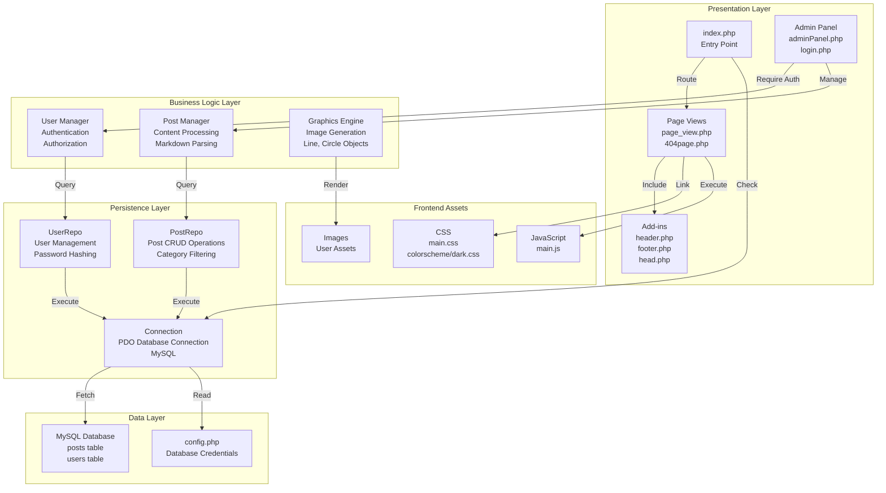

# mudCMS

A fast, simple, and lightweight CMS written in PHP. When you start up the website for the first time, it will prompt you to connect to the database and have you fill in the name and password of the user that will be accessing said database.

## Architecture

mudCMS follows a modular architecture with clear separation between presentation, business logic, and persistence layers:



## Project Structure

```
mudCMS/
├── src/
│   ├── index.php                 # Application entry point & database initialization
│   ├── page_view.php             # Main page viewer
│   ├── 404page.php               # 404 error page
│   ├── addins/                   # Template components
│   │   ├── head.php              # HTML head section
│   │   ├── header.php            # Page header
│   │   └── footer.php            # Page footer with timestamp
│   ├── admin/                    # Admin panel
│   │   ├── adminPanel.php        # Admin dashboard
│   │   ├── login.php             # Admin login
│   │   ├── logout.php            # Session termination
│   │   ├── admin-addins/         # Admin-specific components
│   │   ├── assets/               # Admin graphics utilities
│   │   │   ├── Line.php          # Line drawing utility
│   │   │   ├── Circle.php        # Circle drawing utility
│   │   │   └── GraphicsObject.php# Base graphics class
│   │   └── extras/               # Admin options & utilities
│   ├── assets/                   # Application assets
│   │   ├── init.php              # Initialization & startup checks
│   │   ├── panel.php             # Admin panel template
│   │   ├── conf/
│   │   │   └── config.php        # Database configuration (generated)
│   │   ├── css/                  # Stylesheets
│   │   │   ├── main.css
│   │   │   └── colorscheme/dark.css
│   │   ├── js/
│   │   │   └── main.js           # Client-side functionality
│   │   └── img/                  # Image assets
│   └── persistence/              # Data access layer
│       ├── Connection.php        # PDO connection management
│       ├── PostRepo.php          # Post repository (CRUD operations)
│       ├── UserRepo.php          # User repository & authentication
│       └── ...                   # Other domain repositories
├── testing/                      # PHPUnit test files
├── composer.json                 # PHP dependencies (PSR-4 autoloading)
├── LICENSE                       # MIT License
└── README.md                     # This file
```

## Technology Stack

- **Backend**: PHP 7.x+
- **Database**: MySQL
- **Package Manager**: Composer
- **Testing**: PHPUnit 9
- **Autoloading**: PSR-4 namespace standard
- **Extensions Required**: 
  - PDO (PHP Data Objects)
  - GD (Graphics library)

## Key Components

### Persistence Layer (`src/persistence/`)
- **Connection.php**: Manages PDO connection to MySQL database
- **PostRepo.php**: Handles all post-related database operations (create, read, update, delete, filtering by category)
- **UserRepo.php**: Manages user accounts, authentication, and password hashing

### Frontend (`src/`)
- **index.php**: Entry point that checks database configuration and initializes the application
- **page_view.php**: Displays published content to visitors
- **admin/adminPanel.php**: Admin dashboard for content management
- **admin/login.php**: Authentication interface

### Assets (`src/assets/`)
- **init.php**: Database initialization and startup verification
- **config.php**: Generated during first-time setup with database credentials
- **CSS & JS**: Responsive styling and interactive features

## Information 

The configuration file that is used to access the database is placed here:

- assets
    - conf
        - config.php
        
If you end up creating something that needs database connection, use the following function:
```php
<?php

function dbConnection() { 
    static $connection;
    if(!isset($connection)) {
        include('conf/config.php');
        try {
            $connection = new PDO("mysql:host=$host;dbname=$database", $username, $pass);
        } catch(PDOException $e) {
            echo "Connection failed: " . $e->getMessage();
        }
    }
    return $connection;
}
```

## Markdown Format

This is the markdown format used when posting content:

```Markdown
# h1
## h2
### h3

-- citation

! http://localhost/http/Blog/admin/images/grey_2.jpg : grey_2.jpg

~
$tmp = ($arr[$x] == "") ? "<div></div>" : preg_replace($find, $replace, $arr[$x]);
~
```

## Installation & Setup

1. Clone the repository
2. Install dependencies: `composer install`
3. Access the application in your browser
4. Follow the initial setup wizard to configure your database connection
5. Create your admin user account
6. Start creating content!

## License

MIT License - See LICENSE file for details
